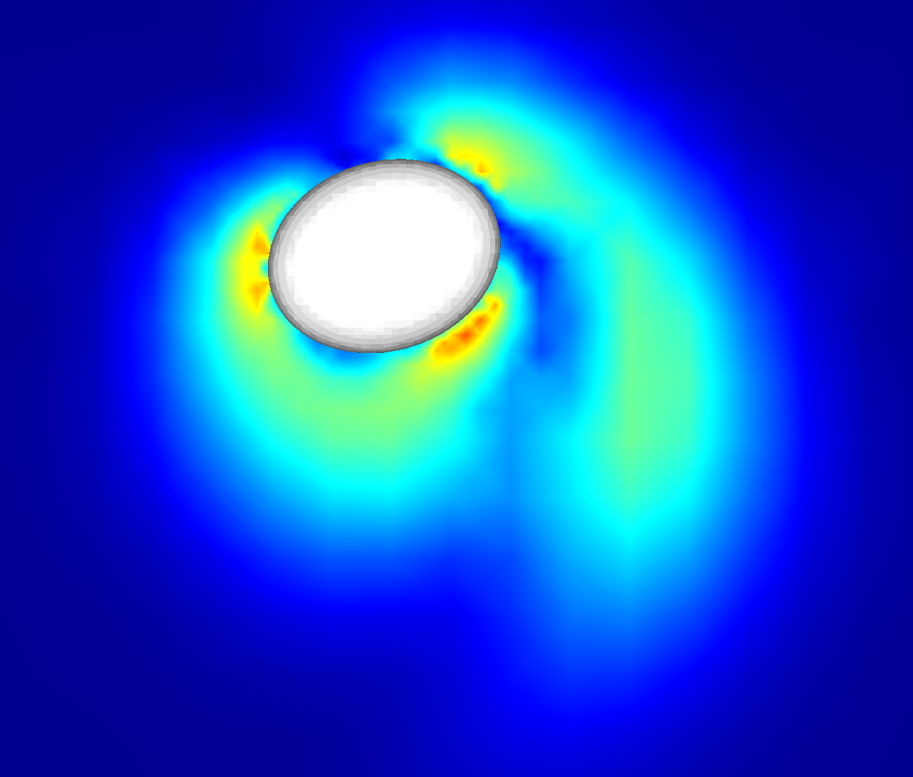

# GISS - Gerris Immersed Solid Solver
GISS is a powerful and efficient 3D Direct Numerical Simulation (DNS) solver to simulate solid-fluid flows with immersed solids in unprecedented detail.

This solver has been developed by Erich Essmann (Institute for Multiscale Thermofluids (IMT), School of Engineering, University of Edinburgh), Pei Shui (IMT, Engineering, University of Edinburgh), Prashant Valluri (IMT, Engineering, University of Edinburgh), Rama Govindarajan (International Centre for Theoretical Sciences, Bangalore), Stéphane Zaleski (Jean Le Rond d'Alembert Institute, Sorbonne Université, Paris) and Stéphane Popinet (Jean le Rond d'Alembert Institute, Sorbonne Université, Paris). 

The GISS numerical solver comprises two sub-solvers: i) The Gerris flow solver and ii) the Immersed Solid Solver. A two-step solution strategy is used. First, the 3D flow equations around the body are solved using the [Gerris Engine](http://gfs.sourceforge.net/wiki/index.php/Main_Page) (developed by Stéphane Popinet) to obtain velocity and pressure fields. These are then used to calculate the hydrodynamic force field on the surface of the immersed solid.  Second, the calculated forces are passed on to the solid solver which calculates the new position of the immersed body using rigid body equations for translation and rotation. These steps allow for two-way solid-fluid coupling at every time step. The solver allows for arbitrary number of solids with arbitrary geometric features in six degree of freedom (6DOF)} motion. The solver can perform dynamical quad/octree mesh optimisation in a Cartesian framework, which greatly simplifies the procedure for mesh generation.

Features
========
* Highly accurate DNS solver using Gerris 
* Open Dynamics Engine used for solid modelling
* Immersed Boundary Method for complex solid geometries
* Wide range of solid/fluid density ratios

Sample Projects
===============

  

Installation
============

Unix users (including Windows users under Cygwin):

```shell
./configure
make
make install
```

See the file 'INSTALL' for generic configure instructions and the tutorial
in doc/tutorial for an introduction on how GISS works.


